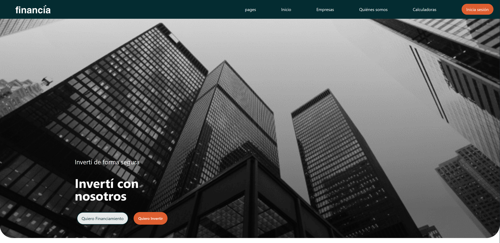

## h3-20-proptech

# Financia

## 

##  Misión 
Generar un impacto social relevante. Ante la falta de opciones
de crédito accesible, ofrecemos a las familias la posibilidad de adquirir un terreno
donde construir su hogar. Al mismo tiempo, proporcionamos a quienes tienen
capacidad de ahorro una forma de invertir sus fondos en un activo de sólida
revalorización a mediano plazo. 

## 🖥 Tech Stack 

 * **Project type:** `Fintech`
 * **QA Tester:** `Github projects` `Drive`.
 * **Backend:** `Python` `Django` `PostgreSql`
 * **Frontend:** `HTML` `CSS` `JS` `React` `Vite` `Axios` `Tailwind` `MUI` `Daisyui`.

## 📌 Team:

| Count | Name |    linkedin.com/in/ | imagen| Github   Nickname| Role   |
| --- |--- | --- | --- | --- | ---: |
| 1  | Juan Ignacio Novas | [**JuanNovas/**](https://www.linkedin.com/in/JuanNovas) | 💻 | [**JuanNovas**](https://github.com/JuanNovas) | Backend   |
| 2  | Jorge Henríquez Novoa | [**jorgea-hn/**](https://www.linkedin.com/in/jorgea-hn/) | 💻 | [**jorgea-hn**](https://github.com/jorgea-hn) | Frontend   |
| 3  | Leon asturizaga | [**leonasturizaga/**](https://www.linkedin.com/in/leon-asturizaga-94a80377) | 💻| [**leonasturizaga**](https://github.com/leonasturizaga) | Frontend   |
| 4  | Edivaldo Laevicth | [**edivaldogomes/**](https://www.linkedin.com/in/edivaldogomes) | 💻 | [**edivaldogomes**](https://github.com/edivaldogomes) | Frontend   |
| 5  | Tania Soto | [**tanisoto/**](https://www.linkedin.com/in/tanisoto) | 📋 | [**tanisoto**](https://github.com/tanisoto) | UX-UI   |
| 6  | UI-Rodrigo| [**UI-Rodrigo/**](https://www.linkedin.com/in/UI-Rodrigo/)| 📋 | [**UI-Rodrigo**](https://github.com/UI-Rodrigo) | UX-UI   |

## 🎥 Promotional Video

[**Financia Video**](https://www.youtube.com/watch?v=financiaVideoUpload)

## 💻 QA Documentation

📂[**Financia**](https://drive.google.com/drive/folders/1UHTC5PIY-nA50L7BCqkimUvDGaVeCUF1?usp=drive_link)

## 💻 Thanks

[**No Country**](https://www.nocountry.tech/)

  

